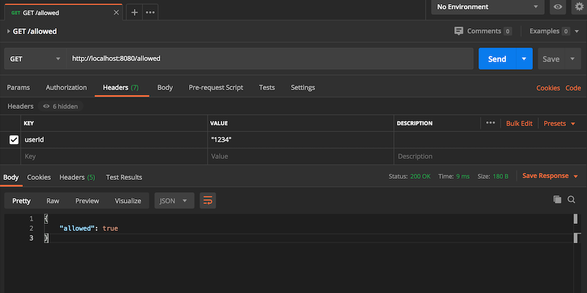

# Tone : An in memeory rate limiter service.

## Tone
This project offers RESTFul API to use as a rate limiting module for other APIs.

## Build status
[](https://travis-ci.com/KalpaD/Tone)


## Tech/framework used
* Git
* Java version "11.0.4"
* Gradle 5.6.1 or above.
* SpringBoot
* Postman

## Features

1. Current implementation contains only fixed time window based rate limiting implemetation. The time window and the maximum number of requests can be connfigured using the application.yml file using the following properties.

```
    fixed.window.rate.limit.max.requests: 100
    fixed.window.rate.limit.time.window.in.seconds: 3600
```
The default configuration allow 100 requests per userId for an hour.

2. When a request get rejected the API responds with a JSON body as follows with a message mentioning the time for the retry.

```
    {
        "allowed": false,
        "message": "Rate limit exceeded. Try again in 2 seconds"
    }
```

## Getting Started

### Clone
To get started you can simply clone this repository using git:
```
git clone https://github.com/KalpaD/Tone.git
cd Tone
```

### Testing ratelimiting API locally.

Step 1: Navigate to following directory and start the server via boot run task.

``` 
gradle bootRun
``` 

Step 2: Import `Tone-RateLimiter.postman_collection.json` to postman which is located at `Postman` directory at the root of the repo.



Step 3: You can use this collection to invoke the /allowd endpoint which does offer the rate limiting.

Step 4: Please note that the postman collection expect you to run the server on port 8080 on localhost.  

## License
Apache License Version 2.0

